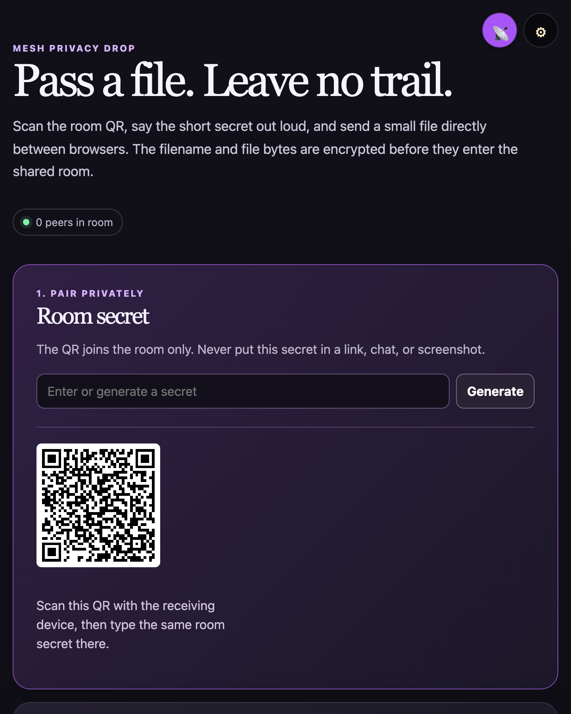
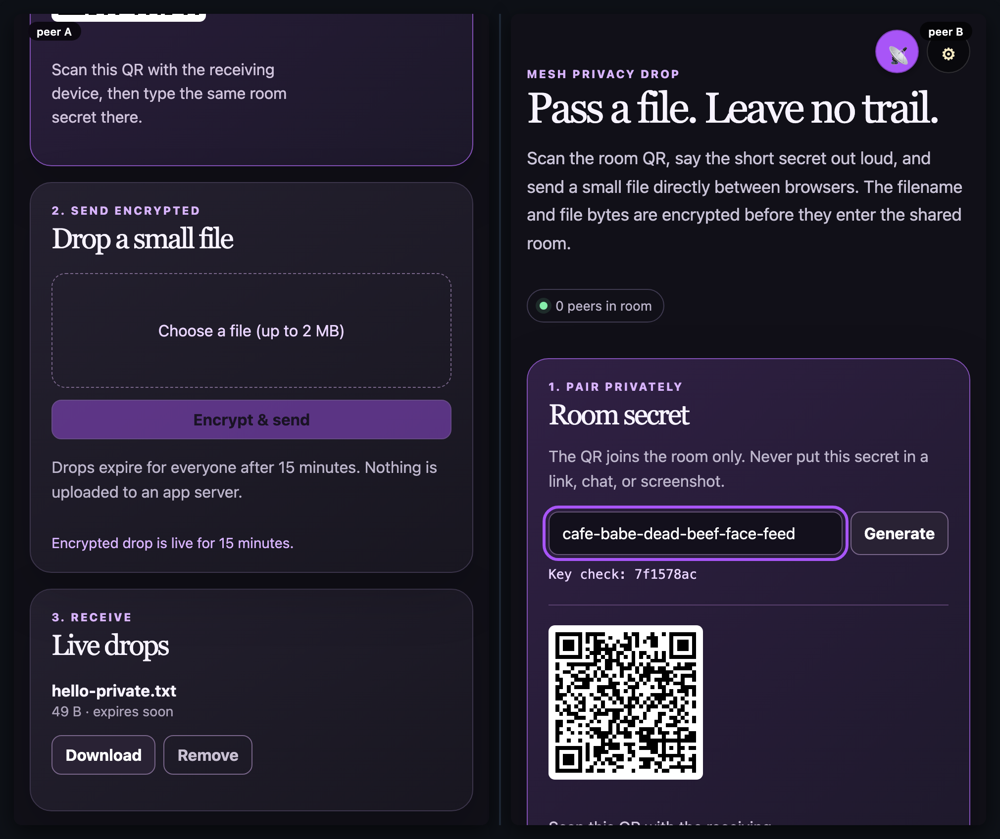

# mesh-privacy-drop

[](https://baditaflorin.github.io/mesh-privacy-drop/)
[](https://github.com/baditaflorin/mesh-privacy-drop/blob/main/package.json)
[](./LICENSE)

> A QR-paired, short-lived encrypted file drop that transfers directly between browsers.

**Live → https://baditaflorin.github.io/mesh-privacy-drop/**

**Source → https://github.com/baditaflorin/mesh-privacy-drop**

**Tip the dev (buy a coffee) → https://www.paypal.com/paypalme/florinbadita**

---



> Two peers, side-by-side, in the same room. Drop a `tests/demo/scenario.mjs`
> exporting `default async (a, b) => …` and run `npm run demo` to regenerate
> `docs/preview.png` plus `docs/demo-a.webm` / `docs/demo-b.webm` clips.



## What it does

`mesh-privacy-drop` is for handing a small file to someone nearby without creating an account or uploading it to an app server. One device shows a QR code; the other scans it to join the same peer room. Both people then enter the same secret **outside the QR/link**, and the sender encrypts the filename and file bytes before publishing them to the room.

Each drop is automatically removed after 15 minutes. The current limit is 2 MB, chosen to keep the browser-only encrypted CRDT transfer responsive.

## Use it

1. Open the [live app](https://baditaflorin.github.io/mesh-privacy-drop/) on the sender's device and choose **Generate** to make a room secret.
2. Scan the displayed QR on the receiving device. Speak or otherwise privately convey the room secret; do not put it in the QR, URL, or chat.
3. Both devices verify the same eight-character key check, then the sender chooses a file and selects **Encrypt & send**.
4. The receiver downloads the file before the shared 15-minute expiry.

## Security boundaries

- File bytes and filename/mime metadata are AES-GCM encrypted locally using the room secret; the secret is not persisted or synchronized.
- QR payloads only join a WebRTC room. They never contain the encryption secret.
- Expiry timestamp, encrypted payload size, timing, and peer membership remain visible to people in the same room.
- Any room peer can delete a drop early. This is deliberate shared-room coordination, not an authorization system.
- The app uses no application backend. WebRTC signaling and TURN may relay connection traffic, but do not receive the plaintext secret or a file before client-side encryption.

Read the principles → **https://baditaflorin.github.io/rootless-computing/principles.html**

## Quickstart

Open the live URL on two devices in the same room (set in ⚙ settings, or scan the drop QR). Everything else is in-app.

For local hacking:

```bash
git clone https://github.com/baditaflorin/mesh-common
git clone https://github.com/baditaflorin/mesh-privacy-drop
cd mesh-privacy-drop
npm install
npm run dev
```

`mesh-common` must sit as a **sibling** directory because `package.json` references it via `file:../mesh-common`.

## Self-hosted infrastructure

| Repo                                              | Endpoint                               | Purpose                     |
| ------------------------------------------------- | -------------------------------------- | --------------------------- |
| https://github.com/baditaflorin/signaling-server  | `wss://turn.0docker.com/ws`            | y-webrtc signaling fan-out  |
| https://github.com/baditaflorin/turn-token-server | `https://turn.0docker.com/credentials` | HMAC TURN creds, 1-hour TTL |
| https://github.com/baditaflorin/coturn-hetzner    | `turn:turn.0docker.com:3479`           | TURN relay                  |

## Settings overrides

The settings drawer lets the user override signaling and TURN endpoints. localStorage keys:

- `mesh-privacy-drop:signalingUrl`
- `mesh-privacy-drop:turnTokenUrl`
- `mesh-privacy-drop:iceServers`
- `mesh-privacy-drop:room`

If endpoints are blank or unreachable, the app falls back to STUN-only.

## Version + commit on every screen

The bottom-right footer on every screen of the live app shows:

- `source` → this repo
- `tip ♥` → PayPal
- `vX.Y.Z · <short-sha>` — version from `package.json` plus the build-time git commit

## Build & deploy

GitHub Pages serves the committed `docs/` directory on the `main` branch. There is no GitHub Actions build workflow; the root `.woodpecker.yml` validates formatting, TypeScript, tests, and the Pages build.

```bash
npm run smoke                                    # build + sanity-check docs/
bash ../mesh-common/scripts/screenshot-app.sh    # regenerate docs/screenshot.png
```

## Privacy

<!-- mesh:privacy-section:start -->

The room secret is local-only and encrypts file contents plus file metadata. Other participants can still observe room participation, encrypted payload size, and expiry timing. The room URL only joins the transport room; it is not the encryption key. Share both deliberately.

See `docs/privacy.md` for the full threat model — capabilities used, what other peers in the mesh see, what the self-hosted infra sees, what stays local.
<!-- mesh:privacy-section:end -->

## License

MIT — see `LICENSE`.
